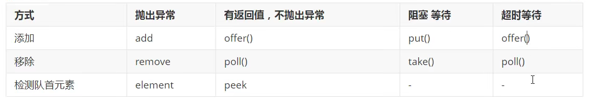

线程状态：

```java
public enum State {

    NEW,

    RUNNABLE,

    BLOCKED,

    WAITING,

    TIMED_WAITING,

    TERMINATED;
}
```

wait/sleep的区别

1.wait所有类都有，sleep只来自Thread

2.wait会释放锁，sleep不会释放锁

3.使用范围不同，wait必须在同步代码块中使用，sleep可以随意

4.wait不需要捕获异常，sleep需要捕获异常，因为sleep可能发生超时等待

**lock锁**

ReetrantLock lock=new ReetrantLock ();

lock.lock();

lock.unlock();

> synchronized 和lock的区别

1.synchronized是关键字lock是关键字

2.synchronized无法判断获取锁的状态，lock可以判断是否获取到锁

3.synchronized会自动释放锁，lock必须手动释放

4.synchronized死锁后会一直等待，lock不会一直等待

5.synchronized是可重入锁，不可中断，非公平；lock可重入锁，可判断锁，可自己设置公平锁和非公平锁

6.synchronized适合锁少量的代码同步问题，Lock适合锁大量的同步代码

为了防止虚假唤醒，所以判断的时候需要用while来判断，不能用if进行判断

**condition的优势：**他可以指定condition进行唤醒

```java

public class TheadTest {
    public static void main(String[] args) {
        Customer customer=new Customer();
        new Thread(()->{
            for(int i=0;i<10;i++){
                try {
                    customer.custom();
                } catch (InterruptedException e) {
                    e.printStackTrace();
                }
            }
        }).start();
        new Thread(()->{
            for(int i=0;i<10;i++){
                try {
                    customer.produce();
                } catch (InterruptedException e) {
                    e.printStackTrace();
                }
            }
        }).start();
    }
}
//传统多线程
class Customer{
    public static int num=0;

    public Customer(){

    }
    public synchronized void custom() throws InterruptedException {
        if(num==0){	//这里使用while可以避免虚假唤醒
            this.wait();
        }
        num--;
        System.out.println(Thread.currentThread().getName()+":"+num);
        this.notifyAll();
    }
    public synchronized void produce() throws InterruptedException {
        if(num==1){
            this.wait();
        }
        num++;
        System.out.println(Thread.currentThread().getName()+":"+num);
        this.notifyAll();
    }
}
//Lock
class NewCustomer{
    public int num=0;
    //默认为公平锁，加了true则为非公平锁
    public Lock lock=new ReentrantLock();
    public Condition condition=lock.newCondition();

    public void custom() throws InterruptedException {
        try{
            lock.lock();
            while(num!=0){
                condition.await();
            }
            num--;
            System.out.println(Thread.currentThread().getName()+":"+num);
            condition.signalAll();
        }catch (Exception e){
            e.printStackTrace();
        }finally {
            lock.unlock();
        }

    }
    public void produce() throws InterruptedException {
        try{
            lock.lock();
            while(num==0){
                condition.await();
            }
            num++;
            System.out.println(Thread.currentThread().getName()+":"+num);
            condition.signalAll();
        }catch (Exception e){
            e.printStackTrace();
        }finally {
            lock.unlock();
        }
    }
}

//Lock 指定唤醒
class NewCustomer{
    public int num=0;
    //默认为公平锁，加了true则为非公平锁
    public Lock lock=new ReentrantLock();
    public Condition condition1=lock.newCondition();
    public Condition condition2=lock.newCondition();
    public Condition condition2=lock.newCondition();
	
    public void printA(){
        print
    }
    public void custom() throws InterruptedException {
        try{
            lock.lock();
            while(num!=0){
                condition.await();
            }
            num--;
            System.out.println(Thread.currentThread().getName()+":"+num);
            condition.signalAll();
        }catch (Exception e){
            e.printStackTrace();
        }finally {
            lock.unlock();
        }

    }
    public void produce() throws InterruptedException {
        try{
            lock.lock();
            while(num==0){
                condition.await();
            }
            num++;
            System.out.println(Thread.currentThread().getName()+":"+num);
            condition.signalAll();
        }catch (Exception e){
            e.printStakTrace();
        }finally {
            lock.unlock();
        }
    }
}

class NewLockPoint{
    public int num=1;
    public Lock lock=new ReentrantLock();
    public Condition condition1=lock.newCondition();
    public Condition condition2=lock.newCondition();
    public Condition condition3=lock.newCondition();

    public void printA(){
        lock.lock();
        try {
            while(num!=1){
                condition1.await();
            }
            System.out.println(Thread.currentThread().getName()+"AAAAAA");
            num=2;
            condition2.signal();
        } catch (InterruptedException e) {
            e.printStackTrace();
        } finally {
            lock.unlock();
        }
    }

    public void printB(){
        lock.lock();
        try {
            while(num!=2){
                condition2.await();
            }
            System.out.println(Thread.currentThread().getName()+"BBBBBB");
            condition3.signal();
            num=3;
        } catch (InterruptedException e) {
            e.printStackTrace();
        } finally {
            lock.unlock();
        }
    }

    public void printC(){
        lock.lock();
        try {
            while(num!=3){
                condition3.await();
            }
            System.out.println(Thread.currentThread().getName()+"CCCCCC");
            num=1;
            condition1.signal();

        } catch (InterruptedException e) {
            e.printStackTrace();
        } finally {
            lock.unlock();
        }
    }
}
```

**8锁现象：**synchronized锁的是调用者，如果是静态方法则锁的是对象的class，每个类只有一个class

线程休眠：TimeUnit.SECONDS.sleep(100)、TimeUnit.DAYS.sleep(100)、TimeUnit.HOURS.sleep(100)

集合多线程不安全问题：

```java
//原生ArrayList多线程不安全
List<String> list=new ArrayList<>();
//解决方案
List<String> list=new Vector<>();	//底层用的是synchronized
//以下两种方法，各种集合在工具类中都提供了
List<String> list=new Collections.synchronizedList(new ArrayList<>());
List<String> list=new CopyOnWriteArrayList<>(); // 底层用的是Lock

```

辅助类：Callable、CountDownLatch 、CyclicBarrier、Semaphore

**Callable**

```java
public class TheadTest {
    public static void main(String[] args) throws ExecutionException, InterruptedException {
        MyCallable myCallable=new MyCallable();
        FutureTask futureTask=new FutureTask(myCallable);
        //定义了两个线程，但是第一个线程的结果会被缓存，效率高
        new Thread(futureTask,"A").start();
        new Thread(futureTask,"B").start();
        //get方法可能会发生阻塞
        Integer out=(Integer) futureTask.get();
        System.out.println(out);
        //程序执行结果为
        //call()
        //1024
    }
}
class MyCallable implements Callable<Integer> {

    @Override
    public Integer call() throws Exception {
        System.out.println("call()");
        return 1024;
    }
}
```

**CountDownLatch 等待所有线程结束，作为一个计数作用**

```java
CountDownLatch countDownLatch=new CountDownLatch(6);
for(int i=0;i<6;i++){
    new Thread(()->{
        System.out.println(Thread.currentThread().getName()+":go out");
        countDownLatch.countDown();
    }).start();
}
//等待所有线程结束后，唤醒主线程
countDownLatch.await();
System.out.println("Close down");
```

**CyclicBarrier：**

```java
CyclicBarrier cyclicBarrier=new CyclicBarrier(7,()->{
    System.out.println("条件满足");
});
for(int i=0;i<7;i++){
    int temp=i;
    new Thread(()->{
        System.out.println(Thread.currentThread().getName()+":"+temp);
        try {
            cyclicBarrier.await();
        } catch (InterruptedException e) {
            e.printStackTrace();
        } catch (BrokenBarrierException e) {
            e.printStackTrace();
        }
    }).start();
}
```

**Semaphore信号量**

```java
Semaphore semaphore=new Semaphore(2);
for(int i=0;i<10;i++){
    new Thread(()->{
        try {
            //如果满了，则会等待其他线程进行release释放
            semaphore.acquire();
            System.out.println(Thread.currentThread().getName()+":进入车位");
            TimeUnit.SECONDS.sleep(2);
            System.out.println(Thread.currentThread().getName()+":离开车位");
        } catch (InterruptedException e) {
            e.printStackTrace();
        } finally {
            semaphore.release();
        }
    }).start();
}
```

**读写锁ReentrantReadWriteLock**：读写锁，读只能一个，写可以多个同时

```java

MyReadWriteLock myReadWriteLock=new MyReadWriteLock();
for(int i=0;i<8;i++){
    int finalI = i;
    new Thread(()->{
        myReadWriteLock.write(String.valueOf(finalI),String.valueOf(finalI));
    }).start();
}

for(int i=0;i<8;i++){
    int finalI = i;
    new Thread(()->{
        myReadWriteLock.read(String.valueOf(finalI));
    }).start();
}

class MyReadWriteLock{
    private volatile HashMap<String,String> map=new HashMap<>();
    private ReadWriteLock lock=new ReentrantReadWriteLock();
    public void read(String key){
        lock.readLock().lock();
        System.out.println(Thread.currentThread().getName()+"读取");
        map.get(key);
        System.out.println(Thread.currentThread().getName()+"结束");
        lock.readLock().unlock();
    }
    public void write(String key,String value){
        lock.writeLock().lock();
        System.out.println(Thread.currentThread().getName()+"写入");
        map.put(key,value);
        System.out.println(Thread.currentThread().getName()+"写入结束");
        lock.writeLock().unlock();
    }
}
```

 阻塞队列BlockingQueue、阻塞双端队列BlockingDeque 这两个相当于Set和Map，有实现类ArrayBlockingQueue、LinkBlockingQueue

```java
ArrayBlockingQueue<String> array=new ArrayBlockingQueue<>();
//add方法，如果队列满了则会报异常,为空执行remove，报异常
array.add("a");
array.remove();
//offer方法，队列满了返回false，不抛出异常，为空poll返回null，不报异常
array.offer("a");
array.poll();
```



**SynchronousQueue：**容量为1,put了一个元素必须取，不然无法再放

**线程池**

https://www.bilibili.com/video/BV1B7411L7tE?p=23

new ThreadPoolExecutor.AbortPolicy() //拒绝策略,队列满了抛出异常

new ThreadPoolExecutor.CallerRunsPolicy() //线程池满了之后，将任务扔给传过来的线程，这里是主线程

new ThreadPoolExecutor.DiscardPolicy() //线程池满了之后，丢掉任务，不抛出异常

new ThreadPoolExecutor.DiscardOldestPolicy() //线程池满了之后，尝试和最早的竞争，不抛出异常

```java
//单个线程
ExecutorService executorService1 = Executors.newSingleThreadExecutor();
//固定线程
ExecutorService executorService2 = Executors.newFixedThreadPool(5);
//可动态变化的
ExecutorService executorService3 = Executors.newCachedThreadPool();
try {
    executorService2.execute(()->{
        System.out.println(Thread.currentThread().getName());
    });
} catch (Exception e) {
    e.printStackTrace();
} finally {
    executorService2.shutdown();
}

//该线程池最大承载数量为 deque大小+max，超过了就rejectexecutionexception
ExecutorService executorService1= new ThreadPoolExecutor(
    2,  //corePoolSize  核心线程数量
    5,//maximumPoolSize 最大线程数量
    3,//keepAliveTime  保持存活时间
    TimeUnit.SECONDS,
    new LinkedBlockingDeque<>(3),//阻塞队列大小
    Executors.defaultThreadFactory(),
    new ThreadPoolExecutor.AbortPolicy() //拒绝策略队列满了抛出异常
);


//该线程池最大承载数量为 deque大小+max，超过了就rejectexecutionexception
ExecutorService executorService2= new ThreadPoolExecutor(
    2,  //corePoolSize  核心线程数量
    5,//maximumPoolSize 最大线程数量
    3,//keepAliveTime  保持存活时间
    TimeUnit.SECONDS,
    new LinkedBlockingDeque<>(3),//阻塞队列大小
    Executors.defaultThreadFactory(),
    new ThreadPoolExecutor.CallerRunsPolicy() //线程池满了之后，将任务扔给传过来的线程，这里是主线程
);

//该线程池最大承载数量为 deque大小+max，超过了就rejectexecutionexception
ExecutorService executorService3= new ThreadPoolExecutor(
    2,  //corePoolSize  核心线程数量
    5,//maximumPoolSize 最大线程数量
    3,//keepAliveTime  保持存活时间
    TimeUnit.SECONDS,
    new LinkedBlockingDeque<>(3),//阻塞队列大小
    Executors.defaultThreadFactory(),
    new ThreadPoolExecutor.DiscardPolicy() //线程池满了之后，丢掉任务，不抛出异常
);

//该线程池最大承载数量为 deque大小+max，超过了就rejectexecutionexception
ExecutorService executorService3= new ThreadPoolExecutor(
    2,  //corePoolSize  核心线程数量
    5,//maximumPoolSize 最大线程数量
    3,//keepAliveTime  保持存活时间
    TimeUnit.SECONDS,
    new LinkedBlockingDeque<>(3),//阻塞队列大小
    Executors.defaultThreadFactory(),
    new ThreadPoolExecutor.DiscardOldestPolicy() //线程池满了之后，尝试和最早的竞争，不抛出异常
);
```

四大函数式接口：lamda表达式、链式编程、函数式接口、Stream流式计算

> 函数式接口：只有一个方法的接口

```java
//函数式接口，传入什么返回什么
Function<String,String> function = new Function<String, String>() {
    @Override
    public String apply(String s) {
        return s ;
    }
};
//使用lamda简化版本的function
//两个泛型，第一个为传入类型，第二个为输出类型。查看源码
Function<String,String> function1=a->{return a ;};
//使用lamda简化版本的function
Function<String,String> function2=a->{return a ;};
System.out.println(function1.apply("huagnda"));

//断定型接口  只有一个输入参数，返回值只能是布尔值
Predicate<String> predicate=new Predicate<String>() {
    @Override
    public boolean test(String s) {
        if(s==null){
            return false;
        }
        return true;
    }
};
//使用lamda简化
Predicate<String> predicate1=(str)->{return str.isEmpty();};
System.out.println(predicate1.test("wer"));

//消费型接口：只有输入没有返回
Consumer<String> consumer=new Consumer<String>() {
    @Override
    public void accept(String s) {
        System.out.println("success");
    }
};
Consumer<String> consumer1=(str)->{
    System.out.println(str);
};
consumer1.accept("sdfsdf");

//供给型接口 没有参数只有返回值
Supplier<Integer> supplier=new Supplier<Integer>() {
    @Override
    public Integer get() {
        return 12;
    }
};
Supplier<Integer> supplier1=()->{return 1024;};
System.out.println(supplier1.get());

/**
* id必须是偶数
* 年龄必须大于23
* 用户年龄+1
* 用户名自倒着排序
* 只输出一个用户
*/
User user1=new User(1,21);
User user2=new User(2,22);
User user3=new User(3,23);
User user4=new User(4,24);
User user5=new User(5,25);
User user6=new User(6,26);

List<User> list = Arrays.asList(user1,user2,user3,user4,user5,user6);
list.stream().filter(user->{return user.id%2==0;})
    .filter(user->user.age>23)
    .map(user->user.age+1)
    .sorted((u1,u2)->u1.compareTo(u2))
    .limit(1)
    .forEach(System.out::println);
;
```


ForkJoin：并行执行数据提高效率，大数据量下使用，<font color="red">判断优缺点</font>

特点：工作窃取，双端队列维护任务

多线程  

多个并行任务的计算

```java
//ForkJoinDemo类的定义
//任务是求和计算
class ForkJoinDemo extends RecursiveTask<Long> {

    private Long start;  // 1
    private Long end;    // 1990900000

    // 临界值
    private Long temp = 10000L;

    public ForkJoinDemo(Long start, Long end) {
        this.start = start;
        this.end = end;
    }

    // 计算方法
    @Override
    protected Long compute() {
        if ((end-start)<temp){
            Long sum = 0L;
            for (Long i = start; i <= end; i++) {
                sum += i;
            }
            return sum;
        }else { // forkjoin 递归
            long middle = (start + end) / 2; // 中间值
            ForkJoinDemo task1 = new ForkJoinDemo(start, middle);
            task1.fork(); // 拆分任务，把任务压入线程队列
            ForkJoinDemo task2 = new ForkJoinDemo(middle+1, end);
            task2.fork(); // 拆分任务，把任务压入线程队列

            return task1.join() + task2.join();
        }
    }
}


public static void main(String[] args) throws ExecutionException, InterruptedException {
        // test1(); // 12224
        // test2(); // 10038
        // test3(); // 153
    }

// 普通程序员
public static void test1(){
    Long sum = 0L;
    long start = System.currentTimeMillis();
    for (Long i = 1L; i <= 10_0000_0000; i++) {
        sum += i;
    }
    long end = System.currentTimeMillis();
    System.out.println("sum="+sum+" 时间："+(end-start));
}

// 会使用ForkJoin
public static void test2() throws ExecutionException, InterruptedException {
    long start = System.currentTimeMillis();

    ForkJoinPool forkJoinPool = new ForkJoinPool();
    ForkJoinTask<Long> task = new ForkJoinDemo(0L, 10_0000_0000L);
    ForkJoinTask<Long> submit = forkJoinPool.submit(task);// 提交任务
    Long sum = submit.get();

    long end = System.currentTimeMillis();

    System.out.println("sum="+sum+" 时间："+(end-start));
}

public static void test3(){
    long start = System.currentTimeMillis();
    // Stream并行流 ()  (]
    long sum = LongStream.rangeClosed(0L, 10_0000_0000L).parallel().reduce(0, Long::sum);
    long end = System.currentTimeMillis();
    System.out.println("sum="+"时间："+(end-start));
}
```

Future异步计算

CompletableFuture

**Volatile**：是java虚拟机提供的轻量级同步机制，加了内存屏障，因此可以避免指令重排，

1.保证可见性

2.不保证原子性     ==可以使用原子类来解决这个问题 ，原子类在底层使用的都是本地方法==

3.禁止指令重排

```java
public class TheadTest {
    private static int flag=1;
    public static void main(String[] args) throws ExecutionException, InterruptedException {
	//子线程的flag不获取到主线程的flag，加了volatile后就同步了
        new Thread(()->{
            System.out.println("begin："+flag);
            while(flag==1){

            };
            System.out.println(flag);
            try {
                TimeUnit.SECONDS.sleep(4);
            } catch (InterruptedException e) {
                e.printStackTrace();
            }
        }).start();
        TimeUnit.SECONDS.sleep(1);
        flag=0;
        System.out.println("over");
    }
}
```

**CAS：**


**公平锁：**

**非公平锁：**（lock  synchronized默认都是非公平锁）

可重入锁：

递归锁：

自旋锁：


