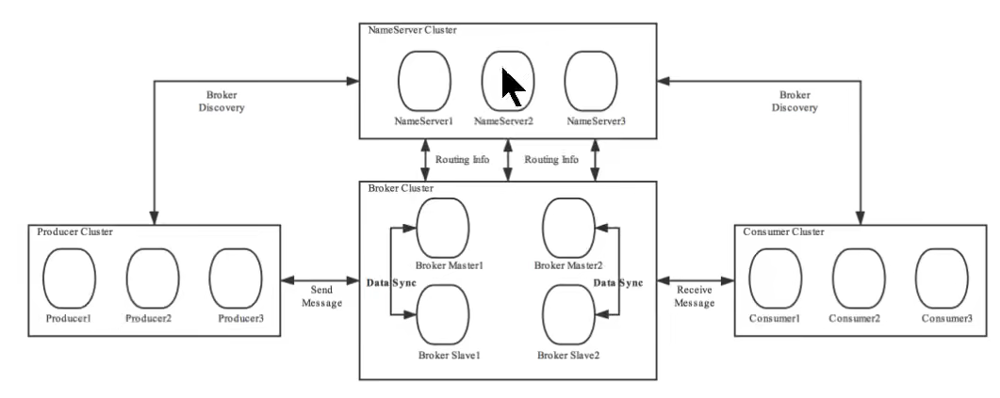
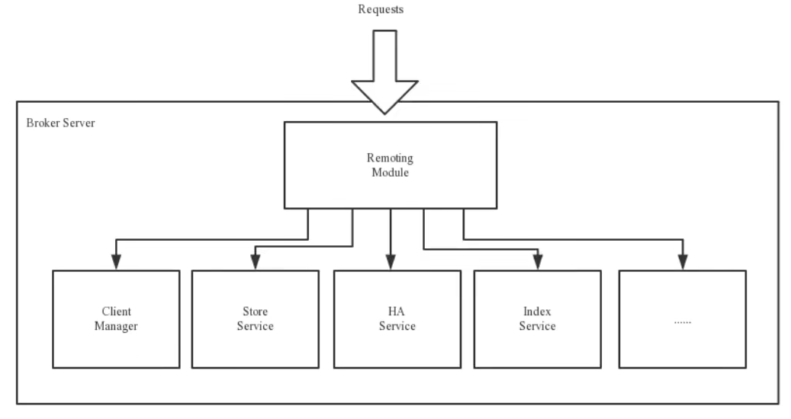
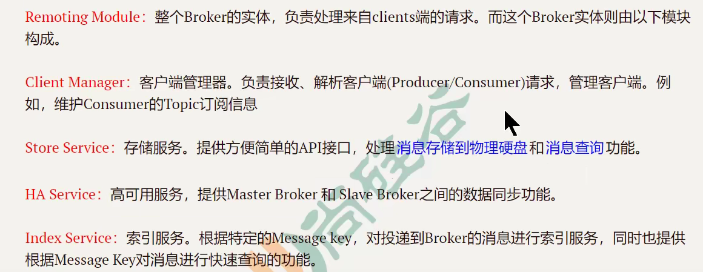

##### Broker移除

NameServer每10秒扫描一次broker表，查看最新的心跳时间，超过120秒则判定失效，剔除

如果broker升级，将broker的读写权限禁掉，当client发送请求则会收到NO_PERMISSION，它便会向其他的的broker发送请求，一段时间后观察这个broker没有请求后便可以关闭移除


#### 路由发现

采用的是pull模型，每隔30秒判断数据是否变化，变化则更新本地

push模型远程数据发生变化，远程服务器会自动推送给本地，这种情况需要建立长连接

long polling模型：长轮询模型。在规定时间内建立长连接，如果数据没发生变化则断开连接，一段时间后再连接

#### 客户端NameServer选择策略

随机选取，生成随机数，对节点数量取模，判断选择哪个节点连接，连接失败后则选择轮询策略。

### Broker

负责消息中转角色，负责存储消息、转发消息





Broker节点集群是主从集群，同一个集群中，节点名称相同，但是id不同，其中id为0的是master，非0为slave。每个broker节点与nameserver集群中的所有节点建立长连接，定时注册Topic到所有的NameServer

### 工作流程

1.启动NameServer，监听端口，等待Broker、Producer、Consumer连接

2.启动Broker，所有Broker与NameServer建立长连接，每30秒向NameServer定时发送心跳包

3.Producer发送消息，启东时与NameServer集群中的一台建立长连接，并从中获取路由信息（当前发送消息的Topic的Queue和Broker地址的映射关系），选择Broker中的一个Queue建立长连接发送消息

4.consumer和Producer一样，多一步向Broker发送心跳，确保Broker的存活状态

### Rocketmq搭建

```bash
#修改主机名
vim /etc/hostname

```

rocketmq的NameServer 和 Broker的启动见：http://rocketmq.apache.org/docs/quick-start/

## 多集群的rocketmq搭建

```bash
#三台服务器启动Name Server
nohup sh bin/mqnamesrv &
tail -f ~/logs/rocketmqlogs/namesrv.log

#在安装位置的conf目录下有提供的配置文件模板
 conf/2m-2s.....
```

自定义配置

```xml
brokerClusterName=DefaultCluster
brokerName=broker-a
brokerId=0
<!--nameserver地址配置，分号分隔-->
namesrvAddr=worker1:9876
<!--发送消息时，自动创建服务器不存在的topic，默认创建数量队列数-->
defaultTopicQueueNums=4
autoCreateTopicEnable=true
autoCreateSubscriptionGroup=true
listenPort=10911

deleteWhen=04
fileReservedTime=48
brokerRole=ASYNC_MASTER
flushDiskType=ASYNC_FLUSH
```

### mqadmin 命令

## 消息样例

- 基本样例
- 顺序消息
- 广播消息
- 延迟消息
- 批量消息
- 过滤消息
- 事物消息
- ACL权限控制

## Spring Cloud Stream

