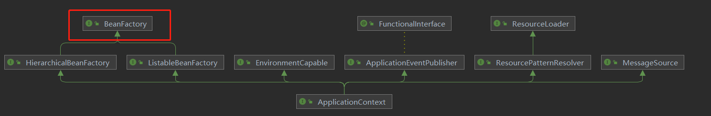
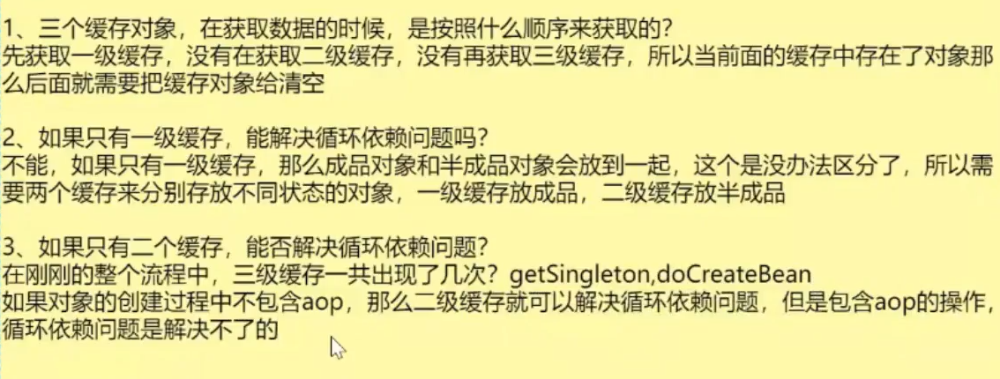
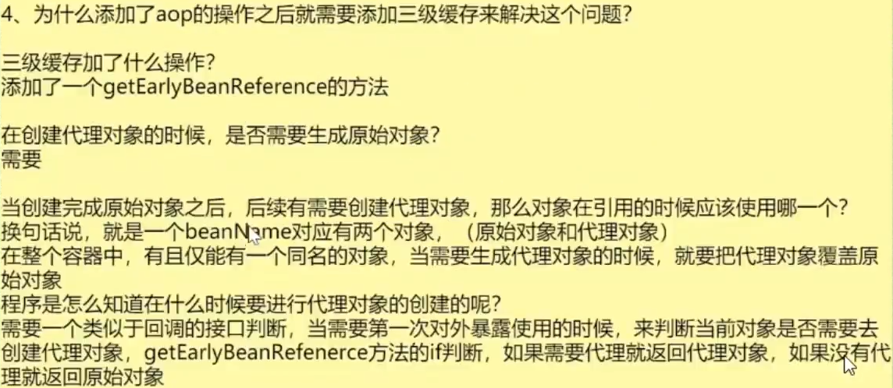
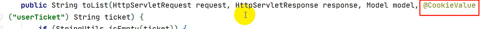

spring

BeanDefintion：是一个父接口，由其他类来实现，获取某个类的BeanDefinition可以通过名称来获得

ApplicationContext

DefaultListableBeanFactory



PostProcessor：增强器/后置处理器

BeanFactoryPostProcessor：可以存在多个，需要实现BeanFactoryPostProcessor接口，将其加入到bean容器中即可，实现了多个BeanFactoryPostProcessor则可以通过实现1.ProrityOrdered接口，2.Ordered接口等排序接口来指明顺序

BeanPostProcessor


加载xml配置文件的属性到当前工厂中，获取BeanFactory

从xml中读取值后，对于${jdbc.username}表达式的值，在BeanFactoryPostProcessor执行后将其赋予真正的值

FactoryBean和BeanFactory的区别

**enhanceConfigurationClasses(beanFactory);**

Proxy.newProxyInstance()


getBean()、doGetBean()、createBean()、doCreateBean()、createBeanInstance()、populateBean()


三级缓存解决循环依赖问题






@Index：在使用@ComponentScan注解的时候是注解扫描包，之前没有引入@Index注解需要在扫描目录下多次进行IO读取需要扫描的类，加了@Index后会将扫描目录下的类名存储在一个文件中，以后进行扫描就不需要多次进行IO读取。该文件存储在/target/classes/META-INF/spring.components文件中。

SPI扩展机制：ServiceLoader，参考：https://www.cnblogs.com/strongmore/p/13284433.html

创建属于自己的starter

在resources下创建一个META_INT/spring.factories 文件，配置如下内容,HuangAutoConfiguration为自己写的配置类，将其注入到新项目的bean中

```factories
# Auto Configure
org.springframework.boot.autoconfigure.EnableAutoConfiguration=\
com.example.HuangAutoConfiguration
```

```java
@Configuration
class HuangAutoConfiguration{
    @Bean
    public Huang getHuang(){
        return new Huang();
    }
    
}
```


@EnableConfigurationProperties

Actutor

Grafana

Prometheus


### spring validation，

可以实现在pojo成员变量上加注解来实现对字段数据的优化，比如@NotNull，@isMobile，@Length（32），在注解的message属性中可以设置返回的消息内容

然后在post方法的参数中添加@Valid 激活，如果boby对象中的某个加了@NotNull的属性为空了，系统会返回400；

如果想要自定义自己的异常来捕获400，可以在传入的参数后面加上BindResult ，用来获取系统的error信息

```java
@RequestMapping()
public void get(@Valid @RequestBody BobyEntity boby,BindResult result){
    if(result.hasErrors){
        result.getFieldErrors().forEach((item)->{
            String message=item.getDefaultMessage();
            String field=item.getField();
            map.put(field,message);
        });
        return R.error(400,"提交的数据不合法").put("data",map);
    }
}
```


异常处理：@RestControllerAdvice 

全局异常处理

分布式session问题

- Session复制

- 前端存储

- Session粘滞

- 后端集中存储

@CookieValue是什么



springmvc可以在访问参数传到controller方法之前使用HandlerMethodArgumentResolver的实现类来对cookie中的参数进行处理然后将其返回。

ThemeleafViewResolver

controller的访问方法有哪些可以直接获取的参数


