### Eureka

api导包：

```xml

    <dependencies>
        <dependency>
            <groupId>org.projectlombok</groupId>
            <artifactId>lombok</artifactId>
        </dependency>
        <dependency>
            <groupId>org.mybatis.spring.boot</groupId>
            <artifactId>mybatis-spring-boot-starter</artifactId>
        </dependency>
        <dependency>
            <groupId>mysql</groupId>
            <artifactId>mysql-connector-java</artifactId>
        </dependency>
        <dependency>
            <groupId>javax.persistence</groupId>
            <artifactId>javax.persistence-api</artifactId>
            <version>2.2</version>
        </dependency>
    </dependencies>

```

deptcontroller导包

```xml

    <dependencies>
        <dependency>
            <groupId>org.projectlombok</groupId>
            <artifactId>lombok</artifactId>
        </dependency>
        <dependency>
            <groupId>org.projectlombok</groupId>
            <artifactId>lombok</artifactId>
        </dependency>
        <dependency>
            <groupId>org.mybatis.spring.boot</groupId>
            <artifactId>mybatis-spring-boot-starter</artifactId>
        </dependency>
        <dependency>
            <groupId>mysql</groupId>
            <artifactId>mysql-connector-java</artifactId>
        </dependency>
        <dependency>
            <groupId>javax.persistence</groupId>
            <artifactId>javax.persistence-api</artifactId>
            <version>2.2</version>
        </dependency>
    </dependencies>

```

consumer使用getForObject导包

```xml

    <dependencies>
        <dependency>
            <groupId>org.projectlombok</groupId>
            <artifactId>lombok</artifactId>
        </dependency>
        <dependency>
            <groupId>org.projectlombok</groupId>
            <artifactId>lombok</artifactId>
        </dependency>
        <dependency>
            <groupId>org.mybatis.spring.boot</groupId>
            <artifactId>mybatis-spring-boot-starter</artifactId>
        </dependency>
        <dependency>
            <groupId>mysql</groupId>
            <artifactId>mysql-connector-java</artifactId>
        </dependency>
        <dependency>
            <groupId>javax.persistence</groupId>
            <artifactId>javax.persistence-api</artifactId>
            <version>2.2</version>
        </dependency>
    </dependencies>
```

eureka导包

```xml
    <dependencies>
        <!-- https://mvnrepository.com/artifact/org.springframework.cloud/spring-cloud-starter-eureka-server -->
        <dependency>
            <groupId>org.springframework.cloud</groupId>
            <artifactId>spring-cloud-starter-eureka-server</artifactId>
            <version>1.4.7.RELEASE</version>
        </dependency>

    </dependencies>
```

eureka配置文件，其中eureka的启动类需要添加注解@EnableEurekaServer

```yml
server:
  port: 8082
eureka:
  instance:
    hostname: localhost
  client:
    register-with-eureka: false
    fetch-registry: false #为false则表示自己为注册中心
    service-url: #监控页面
      defaultZone: http://${eureka.instance.hostname}:${server.port}/eureka/
```

CAP原则：一致性，可用性、分区容错性，一般只能满足其中两个角色，eureka满足可用性和分区容错性，zookeeper满足一致性和分区容错性

### eureka集群

集群配置文件

```yml
server:
  port: 8083
eureka:
  instance:
    hostname: eureka8083.com
  client:
    register-with-eureka: false
    fetch-registry: false #为false则表示自己为注册中心
    service-url: #监控页面
      defaultZone: http://eureka8082.com:8082/eureka/,http://eureka8084.com:8084/eureka/
      #一共三个集群82,83,84,三个集群分别配置另外两个的defaultZone
```


### Ribbon 负载均衡

Ribbon可提供负载均衡的效果

常见的负载均衡有Nginx、Lvs

@EnableDiscoveryClient


需要导入包，ribbon

```xml
        <dependency>
            <groupId>org.springframework.cloud</groupId>
            <artifactId>spring-cloud-starter-netflix-eureka-client</artifactId>
            <version>3.0.4</version>

            <exclusions>
                <exclusion>
                    <groupId>javax.servlet</groupId>
                    <artifactId>servlet-api</artifactId>
                </exclusion>
                <exclusion>
                    <groupId>com.google.code.gson</groupId>
                    <artifactId>gson</artifactId>
                </exclusion>
            </exclusions>
        </dependency>
        <!-- https://mvnrepository.com/artifact/org.springframework.cloud/spring-cloud-starter-netflix-ribbon -->
        <dependency>
            <groupId>org.springframework.cloud</groupId>
            <artifactId>spring-cloud-starter-netflix-ribbon</artifactId>
            <version>2.2.9.RELEASE</version>
        </dependency>

```

消费者配置文件，消费者的启动类需要添加@EnableEurekaClient注解

```yml
server:
  port: 8082
eureka:
  instance:
    hostname: localhost
  client:
    register-with-eureka: false  #因为是消费者，所以不向eureka注册自己 
    service-url: #监控页面
      defaultZone: http://eureka8082.com:8082/eureka/,http://eureka8083.com:8083/eureka/,http://eureka8084.com:8084/eureka/
#配置集群
```

ConfigBean中对getRestTemplate()方法配置注解@LoadBalanced实现Ribbon，

这里对消费者使用getForObject的url用http://服务名   替换掉 http://localhost

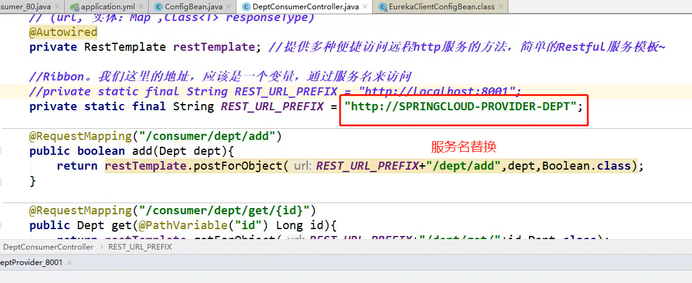

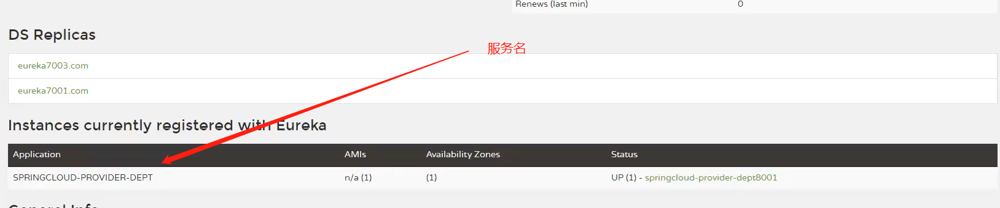

#### 自定义Ribbon负载均衡算法

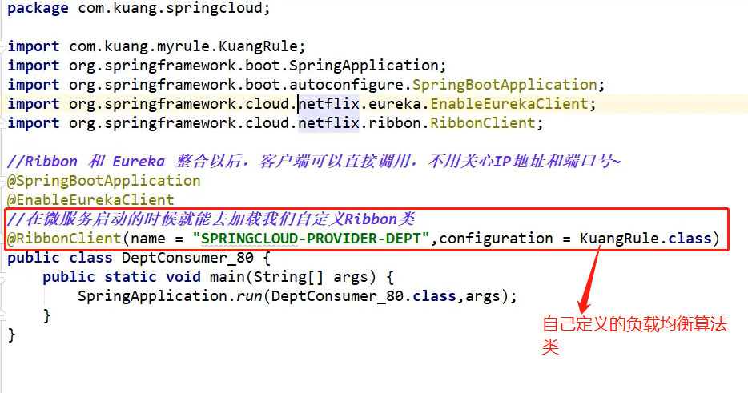

算法实现，这里直接使用已经有的RandomRule()算法，可以查看各种策略的代码，自己重新定义

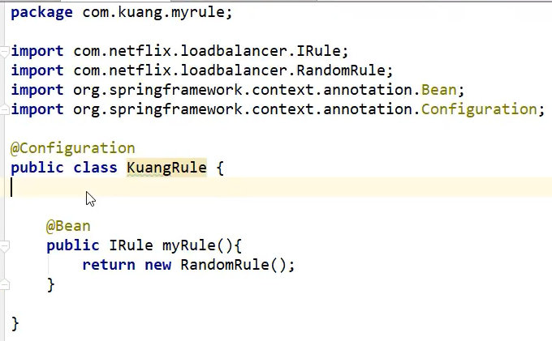

注意自己定义的类放的包位置不能和启动类同级，如下：

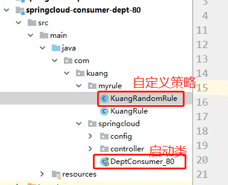

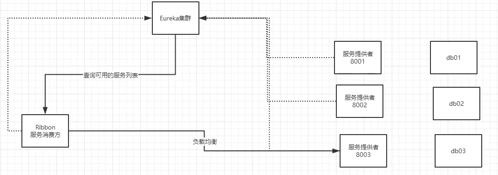

### Feign负载均衡——针对接口的负载均衡

导入依赖

```xml
<dependency>
    <groupId>org.springframework.cloud</groupId>
    <artifactId>spring-cloud-netflix-core</artifactId>
    <version>1.4.7.RELEASE</version>
    <scope>compile</scope>
</dependency>
```

整个访问流程是在api工程中定义Feign的访问服务id，创建对应接口。接着在消费工程中，调用对应接口实现服务id和对应负载的访问。

创建service接口

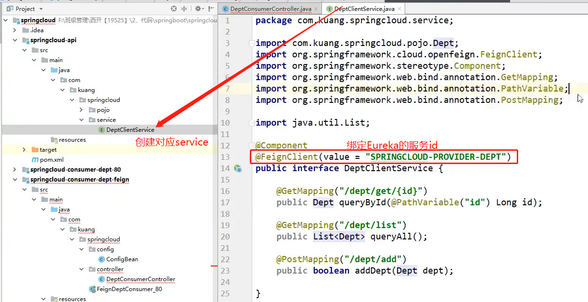

创建对应的访问Controller

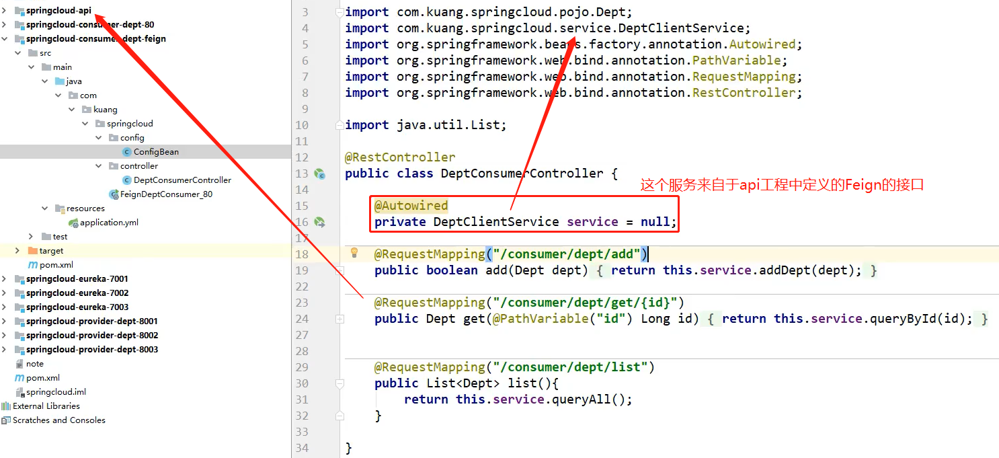

Feign默认使用的是Ribbon的轮询负载算法

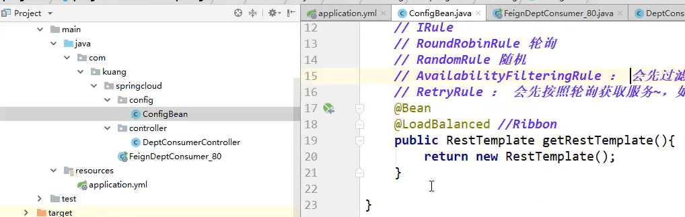

添加扫描注解

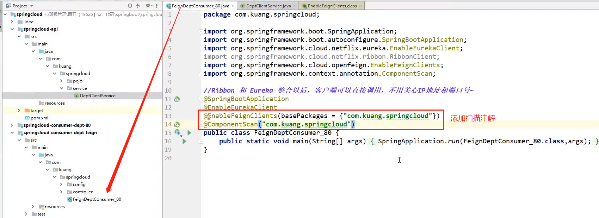 

### Hystrix

- 服务降级
- 服务熔断
- 服务限流
- 接近实时的监控
- ……

熔断机制注解：@HystrixCommand

导入包

```xml
<!-- https://mvnrepository.com/artifact/org.springframework.cloud/spring-cloud-starter-netflix-hystrix -->
<dependency>
    <groupId>org.springframework.cloud</groupId>
    <artifactId>spring-cloud-starter-netflix-hystrix</artifactId>
    <version>2.2.9.RELEASE</version>
</dependency>
```

配置执行失败后的方法

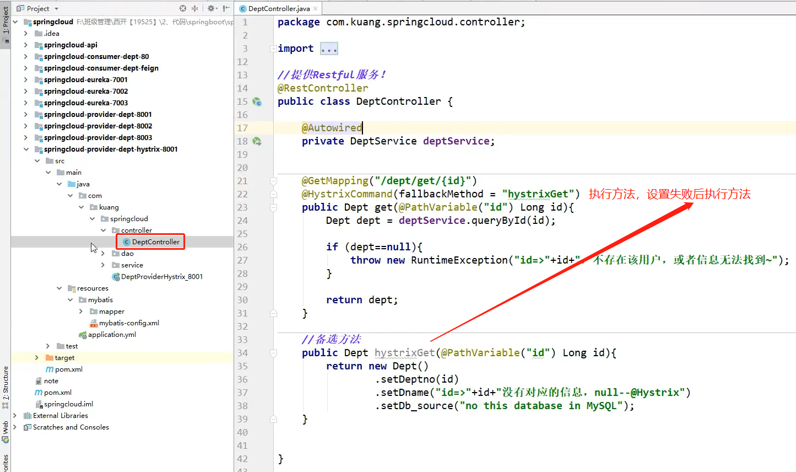

开启熔断的支持

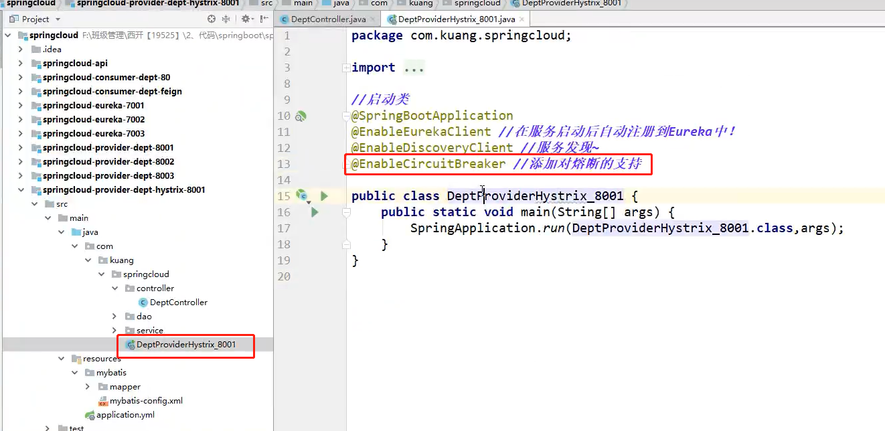

### 服务降级

服务熔断：服务端   某个服务超时或异常，引起熔断

服务降级：客户端   从整体网站请求负载考虑，当某个服务熔断或者关闭之后，服务将不再调用，整体的服务水平下降，但是可用 

创建类

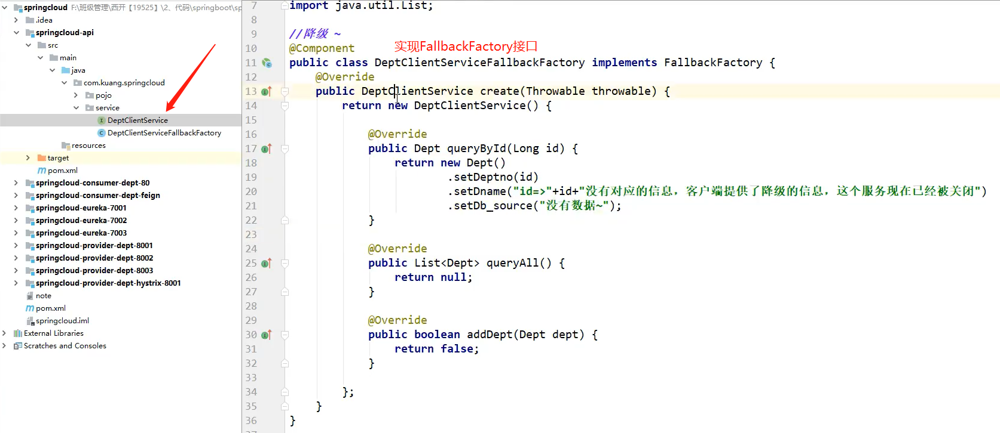

配置类

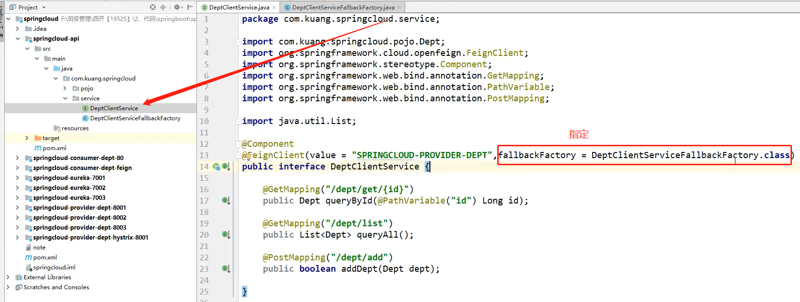

yml配置文件配置

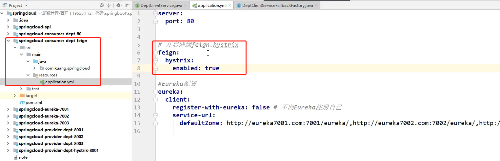

#### Hystrix dashboard

导入依赖

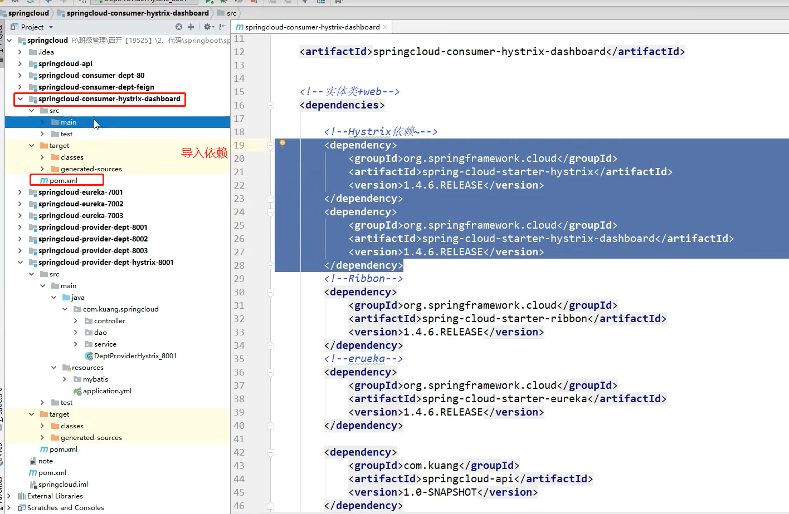

端口配置

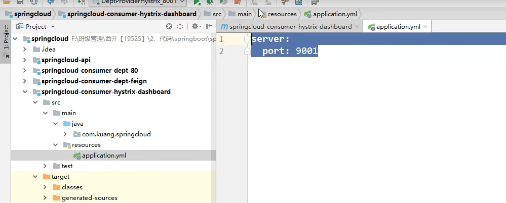

开启注解

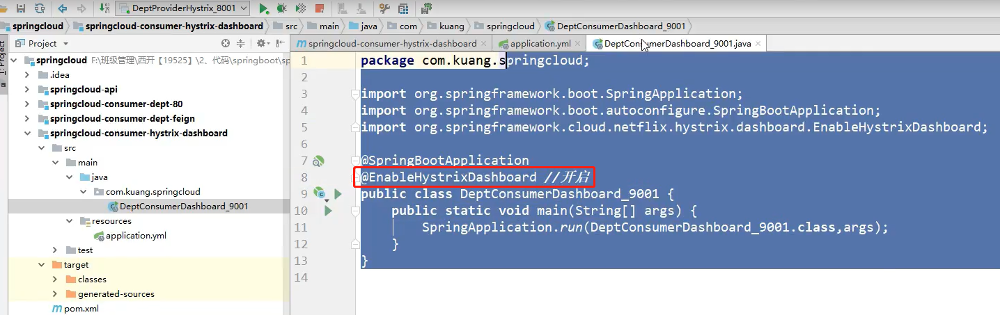

服务添加依赖

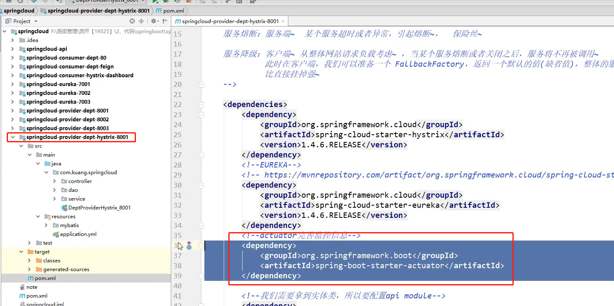

对服务添加

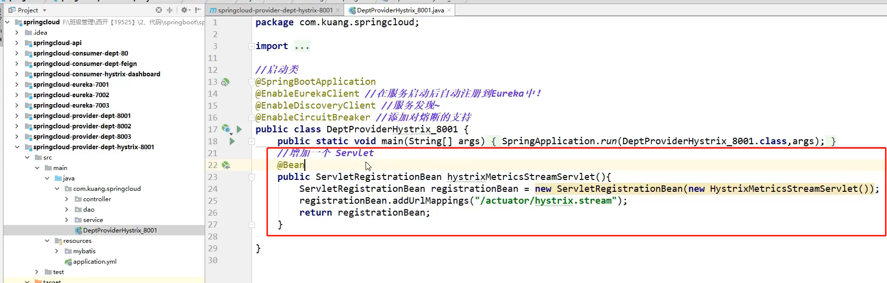


### Zuul路由网关

导入依赖

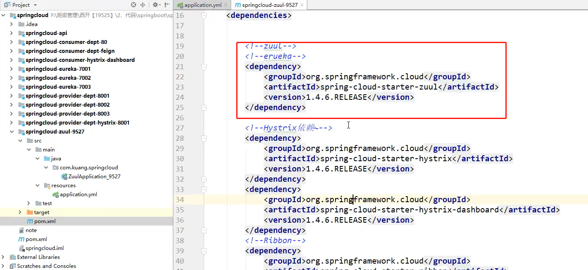

配置路由

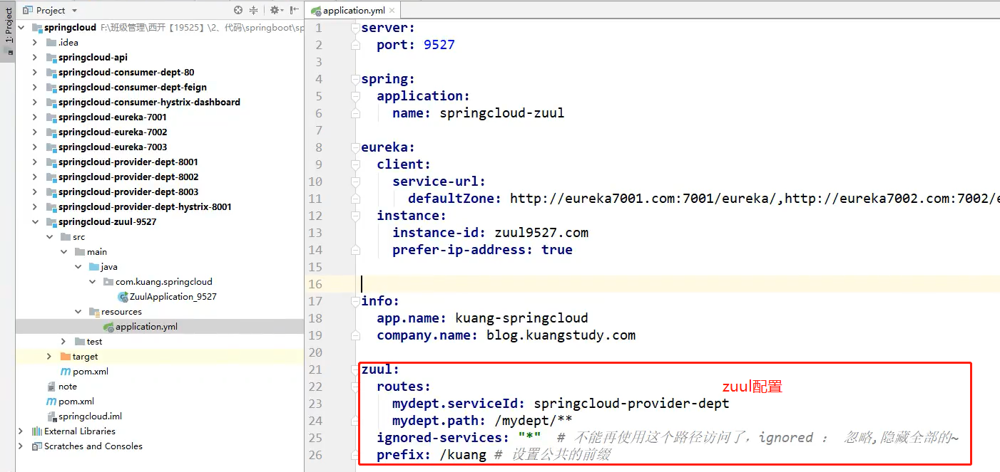

启动类添加注解

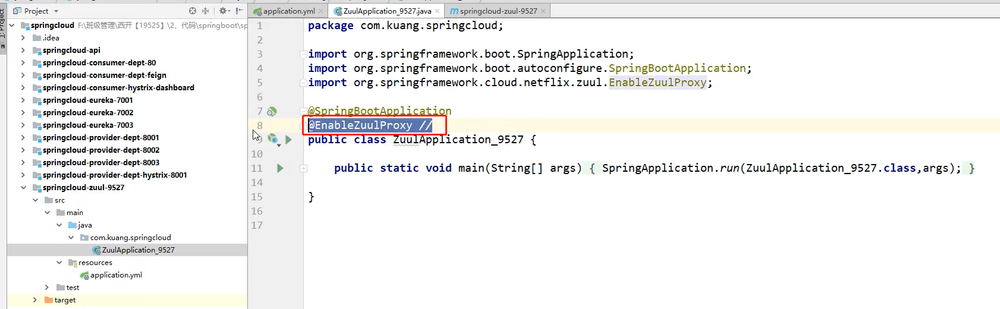


## spring cloud config


## 总结

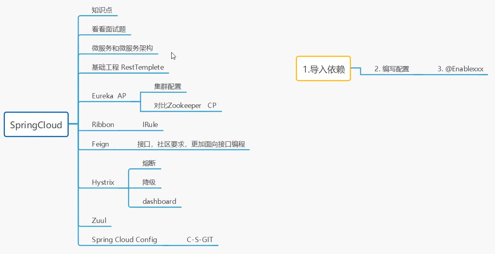


## Nacos

### Nacos Discovery

Nacos服务注册/发现

参考：https://github.com/alibaba/spring-cloud-alibaba/wiki/Nacos-discovery-en

> 1 pom文件，

```xml
<dependency>
    <groupId>com.alibaba.cloud</groupId>
    <artifactId>spring-cloud-starter-alibaba-nacos-discovery</artifactId>
</dependency>
```

> 2 下载nocas服务器，启动服务器：https://nacos.io/zh-cn/docs/quick-start.html

> 3 配置yml，nocas服务地址以及当前需要注册的服务名称gulimall-coupon

```yml
spring:
  cloud:
    nacos:
      discovery:
        server-addr: 127.0.0.1:8848
  application:
    name: gulimall-coupon
```

> 4 启动类开启注解@EnableDiscoveryClient

### Nacos Config

首先在application.properties中配置两个变量，在controller中通过@Value注解进行访问，此时两个变量需要变化就需要重启服务配置。下面通过nacos来实现动态发布配置。

```properties
coupon.user.name=huangda
coupon.user.age=20
```

> 1 引入依赖，这里如果不导入bootstrap依赖，他的bootstrap.properties文件配置不生效，由于版本问题，bootstrap.properties配置需要导入依赖bootstrap

```xml
<dependency>
    <groupId>com.alibaba.cloud</groupId>
    <artifactId>spring-cloud-starter-alibaba-nacos-config</artifactId>
</dependency>

<dependency>
    <groupId>org.springframework.cloud</groupId>
    <artifactId>spring-cloud-starter-bootstrap</artifactId>
</dependency>
```

> 2 在yml同级目录下创建一个bootstrap.properties，在里面配置如下内容

```properties
#当前服务名称
spring.application.name=gulimall-coupon
#nacos中心地址
spring.cloud.nacos.config.server-addr=127.0.0.1:8848
```

> 3 配置中心中加一个服务名.properties的DataId，并将配置内容加入其中，如下

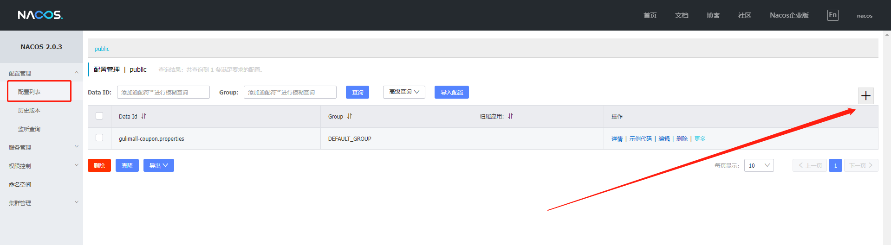

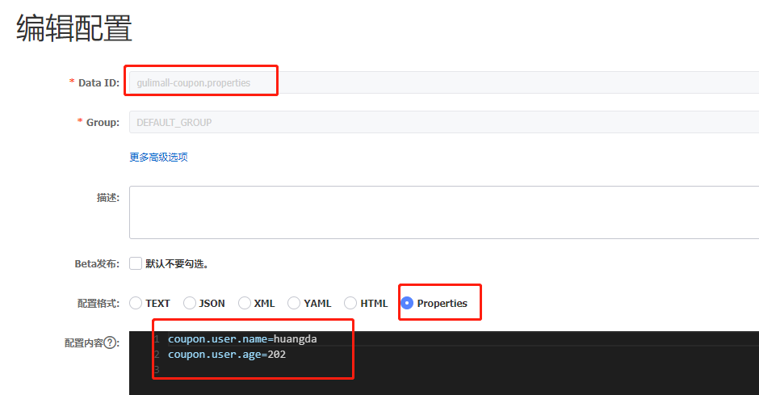

> 4 在访问变量的controller类上添加@RefreshScope

```java
@RefreshScope
@RestController
@RequestMapping("coupon/coupon")
public class CouponController {

    @Value("${coupon.user.name}")
    private String name;
    @Value("${coupon.user.age}")
    private Integer age;

    @RequestMapping("/test")
    public R test(){
        return R.ok().put("name",name).put("age",age);
    }
}
```

#### Nacos Config Namespace and Group

>  1 namespace 和group是对properties文件的一个分类。通过以下方式创建对应的group和namespace

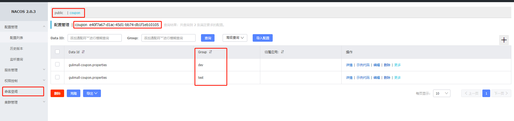

> 2 在bootstrap.properties中配置本服务的属性namespace  group，配置好后，会自动选择对应namespace和group的数据

```properties
spring.application.name=gulimall-coupon
spring.cloud.nacos.config.server-addr=127.0.0.1:8848
spring.cloud.nacos.config.file-extension=properties
spring.cloud.nacos.config.namespace=e40f7a67-d1ac-45d1-bb74-db1f1eb10105
spring.cloud.nacos.config.group=test
```

> 3  可以将不同的配置放到不同的配置文件，然后将配置信息类似上面一样放到配置中心注册，对应的DataId设置成对应的文件名称，最后在bootstrap.properties中配置如下信息，有多个的情况下在extension-configs[i]配置多个序号

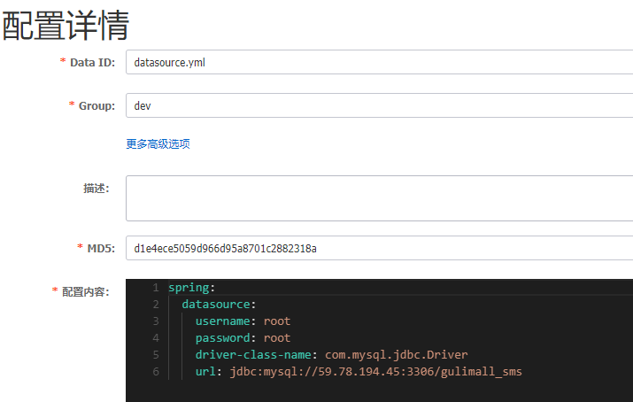

```properties
spring.cloud.nacos.config.extension-configs[0].data-id=datasource.yml
spring.cloud.nacos.config.extension-configs[0].group=dev
spring.cloud.nacos.config.extension-configs[0].refresh=true
```


## OpenFeign

该框架是从A服务调用B服务的访问，所以在A项目中导入包

> 1 pom文件
>
> SpringCloud Feign在Hoxton.M2 RELEASED版本之后不再使用Ribbon而是使用spring-cloud-loadbalancer，所以不引入spring-cloud-loadbalancer会报错

```xml
<dependency>
    <groupId>org.springframework.cloud</groupId>
    <artifactId>spring-cloud-starter-openfeign</artifactId>
</dependency>

<dependency>
    <groupId>org.springframework.cloud</groupId>
    <artifactId>spring-cloud-loadbalancer</artifactId>
    <version>3.0.4</version>
</dependency>
```

> 2 假设A访问B项目中的coupon/coupon/member/coupon，执行方法是getMemberCoupon()，那么需要在项目A中创建对应的CouponFeignService接口，添加B服务的服务名称（该名称为注册中心配置的name）

```java
@FeignClient("gulimall-coupon")
public interface CouponFeignService {
    @RequestMapping("coupon/coupon/member/coupon")
    public R getMemberCoupon();
}
```

> 3 A服务的controller添加访问，此时访问A服务的/coupon/list，里面会自动调用B服务中的getMemberCoupon来得到数据

```java
    @RequestMapping("/coupon/list")
    public R couponList(){
        MemberEntity member = new MemberEntity();
        member.setHeader("huangda");
        R memberCoupon = couponFeignService.getMemberCoupon();
        return R.ok().put("member",member).put("coupon",memberCoupon.get("coupon"));
    }
```

> 4 最后一步需要在A服务的启动类上添加注解@EnableFeignClients(basePackages = "com.atguigu.gulimall.member.feign")，其中basePackages填的是feign接口包名

## GateWay

> 1 开启服务注册发现，配置nacos的配置中心地址

首先要开启注册服务，加入nacos注册中心，gateway依赖导入pom；

启动类添加注解**@EnableDiscoveryClient**

```xml
<dependency>
    <groupId>org.springframework.cloud</groupId>
    <artifactId>spring-cloud-starter-gateway</artifactId>
    <version>3.0.4</version>
</dependency>
```

> 2 在application.properties中配置对应的路由

```yml
spring:
  application:
    name: gulimall-gateway
  datasource:
    username: root
    password: root
    driver-class-name: com.mysql.jdbc.Driver
    url: jdbc:mysql://59.78.194.135:3306/gulimall_sms
  cloud:
    gateway:
      routes:
        - id: baidu
          uri: https://www.baidu.com
          predicates:
            - Query=url,baidu

        - id: qq_route
          uri: https://www.qq.com
          predicates:
            - Query=url,qq

	
        - id: admin_route
          uri: lb://renren-fast
          # 匹配所有api开头的uri
          predicates:
            - Path=/api/**
          # 配置过滤器，将/api/...替换为 /renren-fast/...
          filters:
            - RewritePath=/api/(?<segment>.*),/renren-fast/$\{segment}
```

> 在gateway解决跨域问题，在gateway下添加一下文件，将其注入到bean容器中即可

```java
import org.springframework.context.annotation.Bean;
import org.springframework.context.annotation.Configuration;
import org.springframework.web.cors.CorsConfiguration;
import org.springframework.web.cors.reactive.CorsWebFilter;
import org.springframework.web.cors.reactive.UrlBasedCorsConfigurationSource;

/**
 * @Author William
 * @Date 2021/12/9 12:18
 * @Version 1.0
 */
@Configuration
public class GulimallCrosConfiguration {
    @Bean
    public CorsWebFilter corsWebFilter(){

            UrlBasedCorsConfigurationSource urlBasedCorsConfigurationSource = new UrlBasedCorsConfigurationSource();
            CorsConfiguration corsConfiguration = new CorsConfiguration();
            //配置跨域
            /*允许服务端访问的客户端请求头*/
            corsConfiguration.addAllowedHeader("*");
            /*允许访问的方法名,GET POST等*/
            corsConfiguration.addAllowedMethod("*");
            /*允许访问的客户端域名*/
            corsConfiguration.addAllowedOriginPattern("*");
            /*是否允许请求带有验证信息*/
            corsConfiguration.setAllowCredentials(true);
            urlBasedCorsConfigurationSource.registerCorsConfiguration("/**", corsConfiguration);
            return new CorsWebFilter(urlBasedCorsConfigurationSource);

    }
}

```


总结：

配置注册中心、

### Spring validation，

可以实现在pojo成员变量上加注解来实现对字段数据的优化，比如@NotNull，@isMobile，@Length（32），在注解的message属性中可以设置返回的消息内容

然后在post方法的参数中添加@Valid 激活，如果boby对象中的某个加了@NotNull的属性为空了，系统会返回400；

如果想要自定义自己的异常来捕获400，可以在传入的参数后面加上BindResult ，用来获取系统的error信息

```java
@RequestMapping()
public void get(@Valid @RequestBody BobyEntity boby,BindResult result){
    if(result.hasErrors){
        result.getFieldErrors().forEach((item)->{
            String message=item.getDefaultMessage();
            String field=item.getField();
            map.put(field,message);
        });
        return R.error(400,"提交的数据不合法").put("data",map);
    }
}
```

### 分组校验

创建接口

```java
public interface UpdateGroup{
    
}
public interface AddGroup{
    
}
```

在实体类字段中做校验，并设置对应异常所属的异常接口分组

```java
/*	 * 品牌logo地址
	 */
	@NotBlank(groups = {AddGroup.class})
	@URL(message = "logo必须是一个合法的url地址",groups=	{AddGroup.class,UpdateGroup.class})
	private String logo;
```

在方法调用时，使用@Validated注解绑定

```java
    @RequestMapping("/save")
    public R save(@Validated({AddGroup.class}) @RequestBody BrandEntity brand
    ){
        brandService.save(brand);
        return R.ok();
    }
```


### 自定义校验注解


### 字段为空，返回前端的Json数据直接不包含该字段

添加注解：@JsonInclude(JsonInclude.NON_EMPTY)

该注解表示如果字段数据为空，则返回的json中不包含该字段信息
